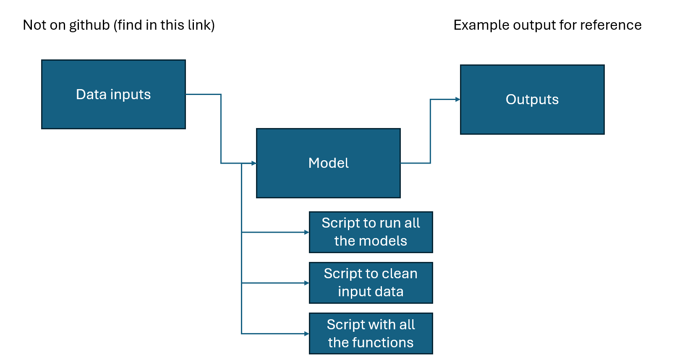

# Example Module 1

This document provides some guidance on the information required when uploading a new resource or model to the Github. 

## Introduction
- What is this project or module about? 
- What background does the user need to know?

## Objective
What does this Module do?

## Data/Inputs
What input data is needed for this module - remember do not store data on GitHub!
* Include links and source
* Explain the quality of data

You may want to use a table to present this information. These are not compulsory
| Data              | Quality and year last updated | Source |
| :---------------- | :------: | ----: |
| Data source 1 (e.g. National Buildings Database)       |   Good , 2024  | Report |
| Data source 2 (e.g. data collected as part of the project          |   Good  , 2024 | Can be found in ERT OneDrive  |
|  Data from reference documents |  Average, 2020 and 2015   | Link|
| Data source 4 |  2024 good data quality   | Link |

## How it works
Please provide a brief explanaiton of how the model/module works. This could include a diagram. 

